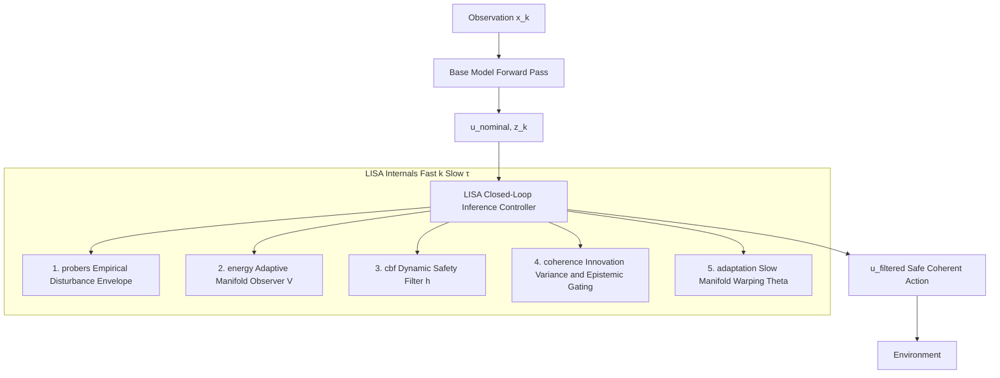

# Latent Invariant Space Adaptation

*LISA formalizes neural inference as a governed flow through latent geometry, maintaining manifold stability via dual-timescale adaptive control.*

---

## 1. Overview

**Latent Invariant Space Adaptation** is a symbiotic control architecture designed for high-dimensional, non-stationary environments. The framework defines neural inference as a trajectory evolving through a high-dimensional latent state space $z_k \in \mathbb{R}^n$. By integrating fast-scale geometric auditing with event-triggered discrete-time control barrier projections, LISA learns the embodied perception of evolving invariants. This framework transforms foundation models into homeostatic dynamical systems, enabling autonomous stabilization in high-stakes environments where state transitions are irreversible.

The architecture treats the base model and the regulatory layer as a single, co-dependent dynamical system. Operating entirely above the task loss, LISA executes fast-scale geometric audits via Koopman embeddings to quantify structural momentum. It continuously regulates the latent representation through low-rank interventions to maintain geometric homeostasis prior to action execution.

Mathematically, the framework models this symbiosis through sampled-data singular perturbation conditions. This design induces a strict two-timescale separation: fast behavioral inference dynamics evolve on the operational timescale $k$, while structural adaptation and epistemic trust evolve on a slower meta-timescale $\tau = \epsilon k$, for $0 < \epsilon \ll 1$. Crucially, LISA functions as an independent regulatory wrapper that preserves the underlying pretrained weights, requiring only read-access to the intermediate latent states and a localized actuation channel.

*Note on Terminology: Throughout this documentation, terms such as "homeostatic" and "metabolically regulated" refer strictly to the formal dynamical maintenance of bounded invariant safe sets ($\mathcal{Z}_{safe}$) and the computational dilation of inference timescales based on Lyapunov stress. They represent the control-theoretic equivalents of biological resilience, rather than literal metabolic energy consumption.*

---

## 2. Formal System Definition and Assumptions

LISA regulates the latent dynamics of the plant, mathematically defined as follows:

$$z_{k+1} = f(z_k) + G(z_k) u_k + d_k \quad \text{(Fast Behavioral Plant)}$$

$$\Theta_{k+1} = \Theta_k - \epsilon_k \Gamma \phi(z_k)^T P \eta_k \quad \text{(Slow Structural Adaptation)}$$

To ensure mathematical tractability and rigorous safety guarantees, the architecture relies on four explicit assumptions:

1. **Local Control Affinity**: Under a first-order Taylor expansion of the residual stream dynamics within a local operating region, the system satisfies $z_{k+1} = f(z_k) + G(z_k) u_k$.

2. **Bounded Disturbance**: The aleatoric environmental disturbance is strictly bounded such that $\|d_k\| \le d_{max}$.

3. **Local Lipschitz Decoding**: Within the invariant safe set, the base model's decoding projection $y = g(z)$ is locally Lipschitz continuous, satisfying $\|g(z_1) - g(z_2)\| \le L\|z_1 - z_2\|$.

4. **Slow Adaptation**: The effective adaptation rate is bounded such that $\epsilon_{base} \gamma_{max} \ll 1$, strictly preserving the singular perturbation timescale separation.

---

## 3. Architecture Flow

LISA functions as a modular regulatory layer for the latent trajectory produced during the base model's forward pass.



---

## 4. The Adaptive Manifold Observer (Koopman Embedding)

To ensure operational semantics for the innovation energy ($\eta_k$), the observer predicts the next latent state by lifting the current state $z_k$ into a high-dimensional feature map $\phi(z_k) : \mathbb{R}^n \rightarrow \mathbb{R}^m$ ($m \gg n$), learned via an MLP, where the dynamics are locally linear.

$$\Psi(z_k, \Theta) = \Theta \phi(z_k)$$

$$\eta_k = z_{k+1} - \Psi(z_k, \Theta) \quad \text{(Innovation Residual)}$$

This frames $\eta_k$ as the residual of the Koopman embedding. Spikes in the **Innovation Energy** $E_k = \|\eta_k\|^2$ signal a failure to self-predict, indicating a geometric regime shift before it manifests in the output tokens.

---

## 5. Core Modulators

LISA dynamically scales adaptation based on the real-time geometric integrity of the latent manifold. The effective update rate is defined as $\epsilon_k = \epsilon_{base} \gamma_k D_k C_k$.

### Trajectory Coherence Metric ($C_k$)

Approximates the local dispersion of the innovation process over a sliding window $W$. When divergence occurs, $C_k \to 0$, safely arresting adaptation during geometrically incoherent regime shifts.

$$C_k = \frac{1}{1 + \frac{1}{W} \sum_{i=k-W}^k \|\eta_i - \bar{\eta}\|^2}$$

### Energy-Based Gain Scheduling ($\gamma_k$)

Scales the adaptive update rate monotonically with the Lyapunov stress $V_k$. To strictly preserve the singular perturbation assumption, this gain is bounded to $\gamma_k \in [1, \gamma_{max}]$.

### Epistemic Plasticity Gate ($D_k$)

A Signal-to-Noise Ratio (SNR) Gate that ensures the system only warps its structural manifold when the geometric discrepancy is directionally informative.

---

## 6. Discrete-Time Control Barrier Functions (DTCBF)

To establish a tractable environmental boundary, LISA utilizes **Active System Identification** to estimate an empirical disturbance envelope $\lambda = \max(\|\Sigma^{-1/2} \Delta z_k\|)$ over a rolling window.

The safe set $\mathcal{C} = \{z \mid h(z) \ge 0\}$ uses a quadratic Lyapunov-like barrier weighted by the latent precision matrix $\Sigma^{-1}$ to maintain numerical stability in high-dimensional anisotropic spaces:

$$h(z) = Z_{crit} - z^T \Sigma^{-1} z$$

To guarantee the forward invariance of $\mathcal{C}$, the control input $u_k$ must satisfy the **Exponential DTCBF condition**:

$$h(f(z_k) + G(z_k)u_k) \ge (1 - \alpha) h(z_k)$$

Because foundation model latents are high-dimensional ($n \sim 10^4$), LISA projects the intervention into a **Principal Intervention Subspace** $B$. The safe control $u_k = Bv_k$ is found by solving a low-rank Quadratic Program (QP):

$$\min_v \|Bv - u_{nom}\|^2 \quad \text{s.t.} \quad \Delta h(z_k, Bv) + \alpha(h(z_k)) \ge 0$$

---

## 7. Theorem of Latent Manifold Stability

We guarantee the stability of the entire loop using a composite Lyapunov candidate that tracks both prediction error and parameter convergence:

$$V_k = \frac{1}{2} \eta_k^T P \eta_k + \frac{1}{2} \mathrm{tr}(\tilde{\Theta}_k^T \Gamma^{-1} \tilde{\Theta}_k)$$

Given the Local Control Affinity assumption and bounded disturbances, the update law ensures discrete-time dissipation:

$$\Delta V_k = V_{k+1} - V_k \le -c\|\eta_k\|^2 + \mathcal{O}(d_{max})$$

For some constant $c > 0$, this proves **Uniform Ultimate Boundedness (UUB)**. The latent trajectory will always remain in a bounded neighborhood of the task-invariant manifold.

---

## 8. Verification: The Weekend Test Protocol

To empirically validate the **Inference Divergence Hypothesis** (hallucination = geometric instability), execute the following protocol on an open-weights model:

1. **Extract Trajectories**: Record $z_k$ (final layer residual stream) for each generated token.
2. **Fit Koopman**: Train $\Theta$ on $\phi(z_k)$ using truthful reasoning traces.
3. **Audit Innovation**: Compute $E_k = \|\eta_k\|^2$ across a test set of logic puzzles.
4. **Observe Spikes**: Verify if a statistically significant spike in $E_k$ precedes the first hallucinated token.
5. **Test Intervention**: Inject a low-rank steering vector $u_k = Bv_k$ to arrest the divergence and measure accuracy recovery.

---

## 9. Implementation: Koopman-CBF Module

```python
"""
lisa/core/koopman_cbf.py
Formal implementation of Koopman Observer and DTCBF Projection.
"""
import torch
import torch.nn as nn

class LISA_Regulator(nn.Module):
    def __init__(self, n_dim, m_lift, alpha=0.1):
        super().__init__()
        # MLP lifts latent state to a linearizable Koopman space
        self.feature_map = nn.Sequential(nn.Linear(n_dim, m_lift), nn.ReLU())
        self.Theta = nn.Parameter(torch.eye(n_dim, m_lift)) # Koopman weights
        self.alpha = alpha # CBF relaxation rate

    def predict_next(self, z_k):
        return self.Theta @ self.feature_map(z_k)

    def compute_innovation(self, z_k, z_next_obs):
        # η_k = observed state - predicted state
        return z_next_obs - self.predict_next(z_k)

    def safety_filter(self, z_k, u_nom, h_func):
        # Enforce geometric homeostasis via DTCBF
        # In practice: Solved via low-rank QP projection (e.g., CVXPY layers)
        h_k = h_func(z_k)
        return u_nom if h_k > 0 else u_nom * (1 - self.alpha)
```

---

## 10. Limitations

To establish realistic operational boundaries, the following limitations are explicitly noted:

- **No Global Guarantees**: Stability and safety guarantees hold only locally, contingent upon the validity of the first-order Taylor linearization.

- **Adversarial Vulnerability**: The empirical disturbance envelope bounds naturally occurring aleatoric drift; it does not guarantee robustness against targeted adversarial perturbations.

- **Covariance Inversion Cost**: Continuous precision matrix updates ($\Sigma^{-1}$) are computationally intensive in ultra-high-dimensional spaces, necessitating batched or asynchronous low-rank approximations.

---

## 11. Conceptual Analogy to Biological Control

While derived strictly from nonlinear sampled-data control theory, LISA's architecture loosely resembles functional motifs observed in biological control systems, specifically the Cortical-Basal Ganglia-Thalamic control loop. The geometric auditing term ($\eta_k$) mirrors sensory prediction error. The gain scheduler ($\gamma_k$) and epistemic gate ($D_k$) parallel dopamine-mediated learning rate modulation. Finally, the CBF optimal control projection mimics the basal ganglia's inhibitory gating of the thalamus, preventing catastrophic actions prior to execution.

---

## Citation

```
Latent Invariant Space Adaptation (LISA): Empirical Synthesis of Velocity-Aware Control Barrier Functions 
and Manifold Stability via Active Environmental Probing, Technical Report, 2026.
```

