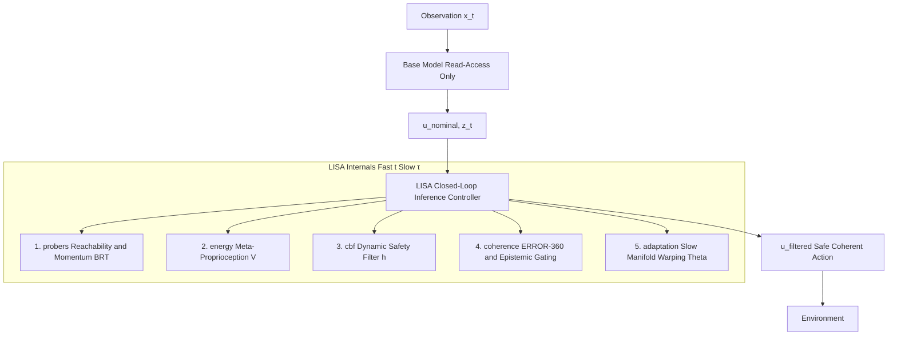

# Latent Invariant Space Adaptation

***LISA** formalizes neural inference as a closed-loop, dual-timescale dynamical system that maintains latent manifold stability under environmental non-stationarity.*

## Overview

**Latent Invariant Space Adaptation** or simply **LISA** is a control-theoretic architecture designed for high-dimensional, non-stationary environments. The framework defines neural inference as a trajectory evolving through a high-dimensional latent state space $z_t \in \mathbb{R}^n$. By integrating closed-loop feedback mechanisms, LISA regulates this dynamical process to ensure structural coherence and systemic stability over the course of the trajectory.

The framework functions as an inference-time control and meta-optimization layer. Operating above the task loss, the system actively probes the environment to synthesize dynamic safety boundaries while continuously warping the latent representation to maintain structural homeostasis. The environment encompasses any process influencing inference dynamics, including distribution shifts, interaction loops, and simulation environments.

LISA models the agent as a **singularly perturbed dynamical system**. This architecture separation induces a two-timescale system where fast inference dynamics evolve on the operational timescale $t$, while structural adaptation occurs on a slower meta-timescale $\tau = \epsilon t$, for $0 < \epsilon \ll 1$. Biological nomenclature in this documentation serves as a functional analogy for formally defined control mechanisms governing latent trajectory regulation.

---

## Architecture Flow

LISA functions as a regulatory layer for the latent trajectory produced during inference. The framework utilizes read-access to the intermediate latent states $z_t$ and nominal outputs $u_t$ at each step to maintain geometric integrity.



---

## Notation

| Symbol | Definition | Timescale | Role |
|--------|------------|-----------|------|
| $z_t \in \mathbb{R}^n$ | Latent state vector | Fast ($t$) | Observed |
| $u_t$ | Nominal output or action vector | Fast ($t$) | Observed |
| $\Theta$ | Slow structural parameters | Slow ($\tau$) | Adapted |
| $\eta$ | Manifold reconstruction error | - | Diagnostic |
| $V$ | Lyapunov energy functional | - | Diagnostic |
| $Z_{crit}$* | Safe latent region boundary | - | Invariant |
| $\lambda$ | Momentum coefficient | - | Parameter |
| $\Psi(u, \Theta)$ | Slow manifold reconstruction mapping | Slow ($\tau$) | Model |

*Note: $Z_{crit}$ is empirically estimated using Backward Reachable Tube (BRT) probes.

---

## Concept Summary

LISA regulates neural inference as a feedback-governed process. It monitors the latent trajectory $z_t$, estimates environmental momentum, enforces safety via control barrier functions, and adapts the latent coordinate system to preserve invariant structure. This design couples fast inference dynamics with slow structural adaptation under provable boundedness guarantees.

---

## Core Mechanics: The Four Pillars of Inference-Time Control

### I. Online Reachability Estimation (Active System Identification)

LISA utilizes active system identification to map the boundary of the environment's Backward Reachable Tube (BRT). By observing the **passive evolution** of latent state velocities after control shutdown, the architecture calculates the empirical supremum of environmental momentum via a multidimensional norm bound:

$$\Delta z_{coast}^{max} = \sup_{\tau \ge t_{off}} \left\| \int_{t_{off}}^\tau \dot{z}(\xi)d\xi \right\|$$

The latent velocity $\dot{z}_t$ is estimated via finite differences across inference steps: $\dot{z}_t \approx (z_t - z_{t-1}) / \Delta t$.

### II. Inference-Time Regulation and Architectural Reflex Arcs

Using the probed supremum, the controller extracts $\lambda$ to synthesize a Velocity-Aware Control Barrier Function (CBF). This formulation provides a first-order empirical bound on the reachable latent manifold:

$$h(z_t) = Z_{crit} - \|z_t + \lambda \dot{z}_t\| \ge 0$$

The **Architectural Reflex Arc** triggers when latent trajectories approach unsafe regions, enforcing an optimal control projection:

$$u_t = \arg\min_u \|u - u_{nominal}\| \quad \text{subject to} \quad h(z_t) \ge 0$$

### III. Latent-Space Meta-Proprioception (Manifold Stability)

**Latent-Space Meta-Proprioception** evaluates the geometric integrity of latent trajectories through proxy energy functionals $V(z, \Theta)$. While the reflex arc operates on the fast timescale $t$, the architecture simultaneously executes slow parametric updates $\Theta$ on the timescale $\tau$. The system structurally adapts the latent coordinate frame to minimize the manifold reconstruction error $\eta = z - \Psi(u, \Theta)$ via a Lyapunov-aligned structural update.

### IV. The Interpretive Layer (Coherence and Epistemic Gating)

The interpretive layer maintains structural invariants through continuous validation of trajectory coherence. This layer derives operational meaning via autonomous, bounded modulators:

- **Perceptual Gravity** ($\gamma_t$): A stress-amplified adaptation gain derived from the Lyapunov energy $V(z)$ that increases structural plasticity monotonically with latent trajectory instability.
- **Synthetic Dopamine** ($D_t$): An epistemic plasticity gate that modulates the adaptation rate $\epsilon$ based on the signal-to-noise ratio of latent trajectory discrepancies.
- **ERROR-360** (Coherence $C(t)$): A geometric diagnostic that evaluates the multi-perspective consistency of latent trajectories through frequency analysis, phase-alignment, and oscillatory coupling.

---

## Theorem of Latent Manifold Stability (UUB Guarantee)

To guarantee systemic stability, LISA utilizes Lyapunov's Direct Method to prove **Uniform Ultimate Boundedness (UUB)**. Let $\eta(t)$ represent the manifold deviation and $\tilde{\Theta}(t) = \Theta(t) - \Theta^*$ represent the structural parameter error. The composite Lyapunov energy functional is defined as:

$$V(\eta, \tilde{\Theta}) = \frac{1}{2}\eta^T P \eta + \frac{1}{2}\mathrm{tr}(\tilde{\Theta}^T \Gamma^{-1} \tilde{\Theta})$$

$P$ and $\Gamma$ are positive-definite weighting matrices controlling energy scaling. Given fast inference error dynamics $\dot{\eta} = A \eta + \phi(z,u) \tilde{\Theta} + d(t)$ where $A$ is Hurwitz and $A^T P + P A = -Q$, LISA executes the adaptation law $\dot{\Theta} = - \Gamma \phi(z,u)^T P \eta$.

Energy dissipation ($\dot{V} < 0$) is guaranteed whenever $\|\eta\| > \frac{2 \|P\| d_{max}}{\lambda_{min}(Q)}$, where $d_{max}$ is the bound on unmodeled environmental chaos. The deployed, modulated structural dynamics are governed by:

$$\dot{\Theta} = -\epsilon_{base} \gamma_t D_t C(t) \Gamma \phi(z,u)^T P \eta$$

---

## Quickstart: Numerically Stable Toy Dual-Timescale System

This toy example utilizes a 2D latent state and linear dynamics to demonstrate singular perturbation mechanics.

```python
"""
Quickstart: Numerically stable LISA dual-timescale dynamics.
Features:
1) Fast/Slow Separation (z: fast, Theta: slow)
2) Perceptual Gravity (gamma_t): Stress-Amplified Gain
3) Synthetic Dopamine (D_t): Epistemic Plasticity Gate
"""
from __future__ import annotations
import numpy as np

def f(z: np.ndarray, u: np.ndarray, Theta: np.ndarray) -> np.ndarray:
    # dz/dt = A(Theta)z + Bu
    A = np.array([[Theta[0], 0.0], [0.0, Theta[1]]])
    B = np.eye(2)
    return A @ z + B @ u

def g(z: np.ndarray, u: np.ndarray, Theta: np.ndarray) -> np.ndarray:
    # dTheta/dt target: Alignment with absolute latent magnitudes
    target = np.abs(z)
    return target - Theta

def V(z: np.ndarray, Theta: np.ndarray) -> float:
    # Lyapunov energy audit
    return 0.5 * float(np.linalg.norm(np.abs(z) - Theta) ** 2)

def main() -> None:
    dt, T = 0.01, 5.0
    steps = int(T / dt)
    z, Theta, u = np.array([1.0, -0.5]), np.array([0.0, 0.0]), np.array([0.0, 0.0])
    epsilon_base, Sigma, beta_ema = 0.05, 1.0, 0.95
    energies = []

    for step in range(steps):
        # Fast behavioral dynamics (t)
        z = z + dt * f(z, u, Theta)

        # Meta-proprioceptive stability audit
        E = V(z, Theta)
        energies.append(E)
        delta = float(np.linalg.norm(np.abs(z) - Theta)) # Manifold deviation

        # Epistemic signal-to-noise estimation (EMA)
        Sigma = beta_ema * Sigma + (1 - beta_ema) * (delta ** 2)

        # Modulators
        gamma_t = 1.0 + 1.0 * float(np.tanh(2.0 * E))
        D_t = 1.0 / (1.0 + float(np.exp(-(delta / (Sigma + 1e-6) - 0.5))))

        # Slow structural dynamics (tau)
        epsilon = epsilon_base * min(gamma_t, 10.0)
        Theta = Theta + dt * (epsilon * D_t) * g(z, u, Theta)

        if step % 100 == 0:
            print(f"Step {step:4}: V={E:.4f} | gamma={gamma_t:.2f} | D={D_t:.2f}")

    print(f"\nFinal manifold error: {energies[-1]:.4f}")

if __name__ == "__main__":
    main()
```

---

## Repository Structure

```
LISA/
├── __init__.py
├── probers/         # Active System Identification & BRT reachability estimation
├── cbf/             # Dynamic Control Barrier Function synthesis & optimal projection
├── adaptation.py    # Slow structural updates g(z, u, Theta) & Lyapunov dynamics
├── dynamics.py      # Fast behavioral dynamics f(z, u, Theta)
├── energy.py        # Meta-proprioceptive proxy energy functionals V(z, Theta)
├── coherence.py     # ERROR-360 diagnostics, Perceptual Gravity, Synthetic Dopamine
└── simulation.py    # ODE integrators and singular perturbation utilities
```

---

## Citation

> Latent Invariant Space Adaptation (LISA): Empirical Synthesis of Velocity-Aware Control Barrier Functions and Manifold Stability via Active Environmental Probing, Technical Report, 2025-2026.


